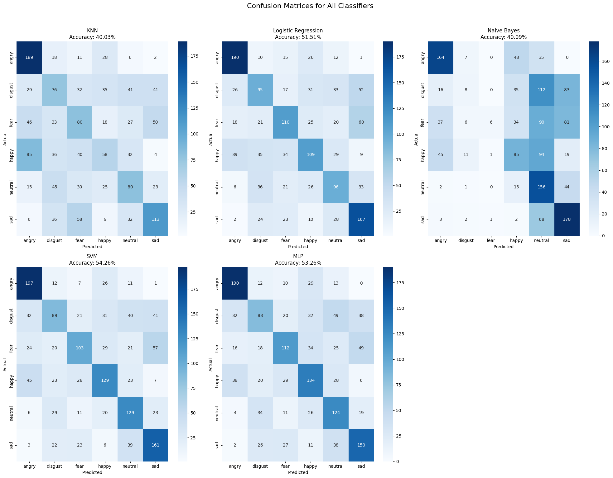
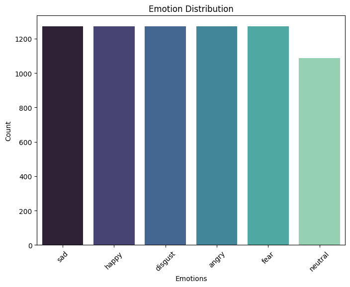

# 🎵 Audio Sentiment Analysis

## 📌 Project Overview
This project develops and evaluates a sentiment analysis pipeline for **audio recordings**.  
It uses the **CREMA-D dataset** to extract features such as **MFCCs, Chroma, and Spectral properties**,  
and trains several machine learning models to classify emotions in speech.

---

## ✨ Features
- 🎤 Audio preprocessing for noise reduction
- 🎶 Feature extraction using MFCCs, Chroma, and Spectral features
- 🤖 Models implemented:
  - Logistic Regression
  - Naive Bayes
  - K-Nearest Neighbors (KNN)
  - Support Vector Machine (SVM)
  - Multi-Layer Perceptron (MLP)
- 📊 Evaluation metrics: Accuracy, F1-score, Confusion Matrices
- 🖥️ Interactive Jupyter Notebook to experiment with different models

---

## 📚 Dataset
We used the [CREMA-D dataset](https://www.kaggle.com/datasets/ejlok1/cremad),  
which contains **7,442 audio samples** with six labeled emotions:
- Angry 😠
- Happy 😃
- Sad 😢
- Neutral 😐
- Fear 😨
- Disgust 🤢

---
## 📊 Results
- The MLP model achieved the highest accuracy among all tested models.
- Class imbalance affected minority classes such as *fear* and *disgust*.

